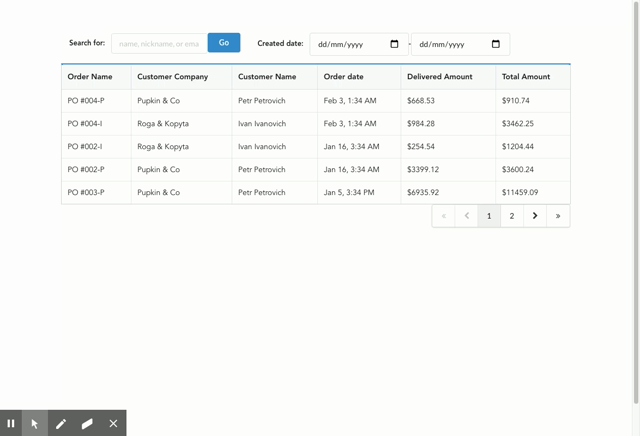

# Packform App
> Dashboard for packform-app



Dashboard is for monitoring orders on packform.

## Installing / Getting started

The app is composed of two major elements: client app (Vuejs) and server app (Go). Further commands are executed at the root directory of the app. To start the client app, use the command below.

```shell
npm run serve
```

To start the server app, use the command below.
```shell
go build backend/* && ./app
```

After executing both commands, client app will start on port 8080 and server app on port 8888.

### Initial Configuration

Before running client and server apps, postgreSQL and mongoDB need to be available running on localhost, listening to port 5432 and 27017 respectively.

Also, dependency will need to be managed by executing:
- `npm i` from root directory.
- `go get` from `backend` directory.

## Features

Features include:
- When I open the `/orders` page
  - Then I should see the list of all customer order
  - And I should be able to search orders by part of the order or product name2
  - And I should be able to filter orders by date range (Melbourne/Australia TZ)
  - And I should see maximum 5 orders per page
  - And I should be able to switch between pages
  - And for every order the following information should be displayed:
    - Order name
    - Customer Company name
    - Customer name
    - Order date (Melbourne/Australia TZ)
    - Delivered amount (dash if nothing is delivered)
    - Total amount

## Licensing

The code in this project is licensed under MIT license.
